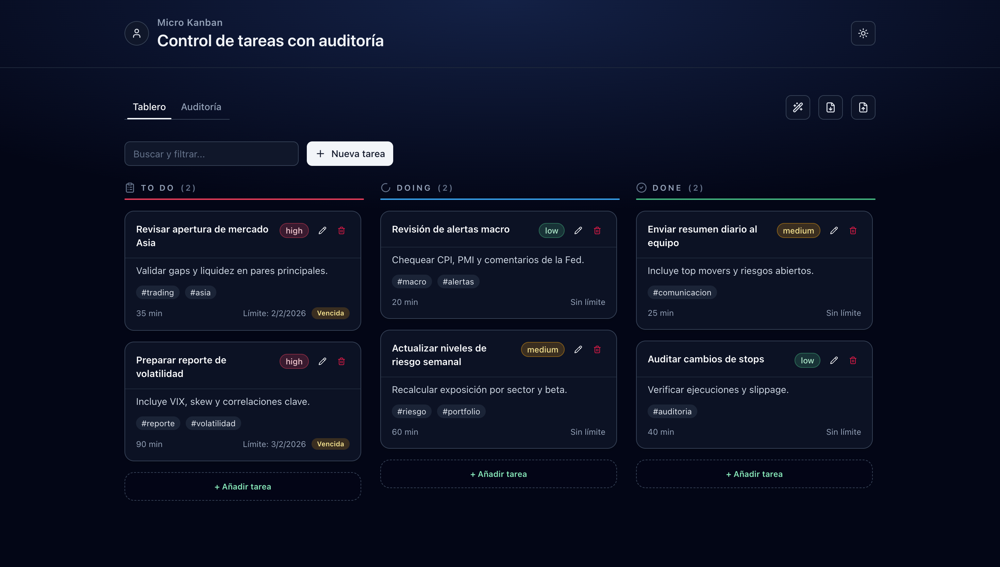
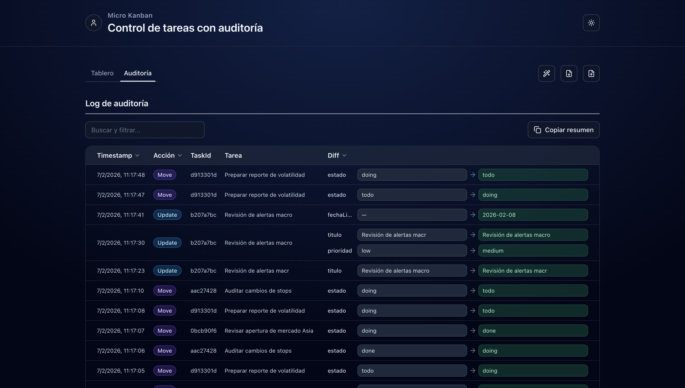
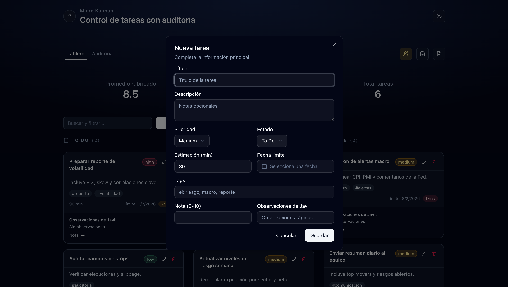

# Micro Trello

Tablero Kanban ligero para crear, editar, mover y evaluar tareas de forma visual.

## Objetivo

El objetivo de este proyecto es ofrecer una herramienta simple y rápida para organizar tareas en columnas (`To Do`, `Doing`, `Done`), con soporte para:

- Prioridades y etiquetas
- Fecha límite
- Ordenación visual por arrastre (drag & drop)
- Registro de auditoría de cambios
- `Modo Dios` para notas y observaciones de evaluación

## Demo

Aplicación desplegada en Vercel:

- https://micro-trello.vercel.app/

## Cómo usar

### 1. Instalar dependencias

```bash
npm install
```

### 2. Ejecutar en local

```bash
npm run dev
```

Abre en el navegador:

- http://localhost:3000

### 3. Build de producción

```bash
npm run build
npm start
```

## Capturas

### 1. Vista general del tablero



### 2. Auditoría



### 3. Crear tarea



## Checklist de requisitos

Funcionales:
- [x] Kanban con 3 columnas fijas (`To Do`, `Doing`, `Done`)
- [x] Crear, editar y borrar tareas
- [x] Modelo de tarea con `id`, `titulo`, `descripcion`, `prioridad`, `tags`, `estimacionMin`, `fechaCreacion`, `fechaLimite`, `estado`
- [x] Drag & Drop entre columnas
- [x] Log de auditoría con `timestamp`, `accion`, `taskId`, `diff`, `userLabel: "Alumno/a"`
- [x] Vista de auditoría en tabla con filtros por acción y por tarea (`taskId`/título)
- [x] Botón `Copiar resumen` en auditoría
- [x] Persistencia de tablero + auditoría en `localStorage`
- [x] Exportar JSON
- [x] Importar JSON con validación y alerta de errores
- [x] Evitar IDs duplicados/incorrectos en importación
- [x] `Modo Dios`: observaciones por tarea, rúbrica rápida (0–10) y comentarios
- [x] Búsqueda avanzada completa con operadores: `tag:`, `p:`, `due:`, `est:<...` / `est:>=...`
- [x] UI de ayuda con ejemplos de operadores (Tooltip/Popover)

Técnicos:
- [x] UI con componentes Shadcn (Dialog, Form, Select, Badge, Tabs, Table, Sonner, AlertDialog)
- [x] Empty states visibles y con diseño
- [x] TypeScript sin `any`
- [x] Validación con Zod
- [x] Separación base por capas (`types.ts`, `lib/storage.ts`, `lib/query.ts`, componentes)
- [x] Atajos y navegación por teclado (crear, buscar y mover tareas)
- [x] Gestión de foco al abrir/cerrar modales
- [x] `aria-label` en acciones principales
- [x] Estados de foco visibles/contraste usable

GitHub/entrega:
- [x] Mínimo 10 commits con mensajes significativos
- [x] README completo

## Decisiones técnicas

Se utilizó una estructura por partes para facilitar el mantenimiento.
La búsqueda separa las palabras y filtra las tareas.
El filtrado solo se actualiza cuando hay cambios relevantes, para mejorar el rendimiento.
La auditoría registra el estado anterior y posterior de cada acción en una tabla clara.
La información se guarda en localStorage y, al importar, se revisa y corrige el formato si es necesario.

## Stack

- Next.js
- React
- TypeScript
- Tailwind CSS
- Framer Motion
- dnd-kit

## Scripts

```bash
npm run dev      # desarrollo
npm run build    # build producción
npm start        # ejecutar build
npm run lint     # lint
```
